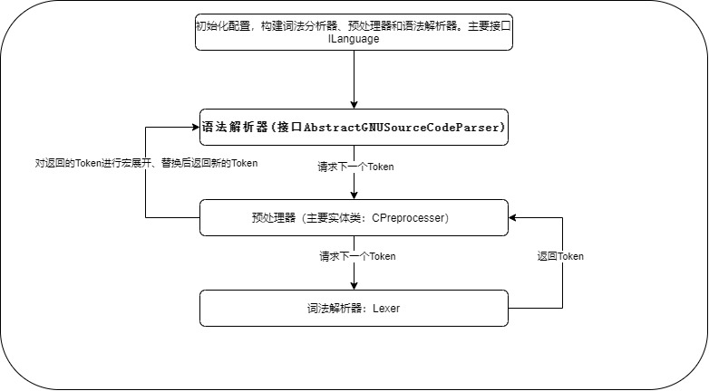
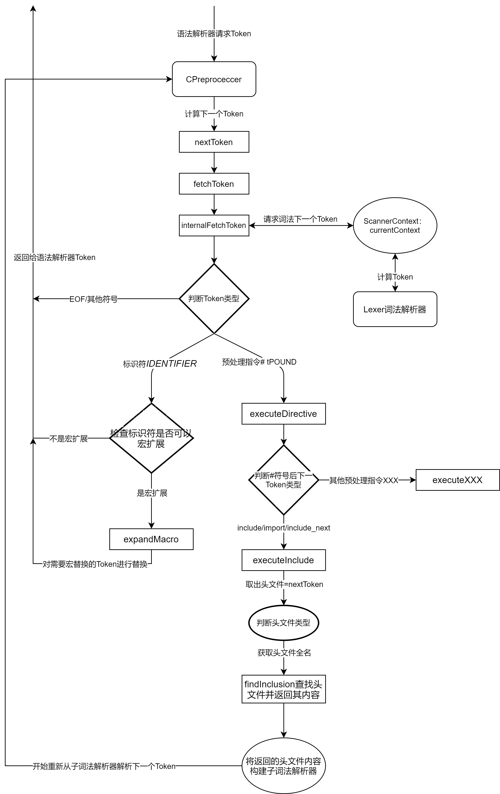
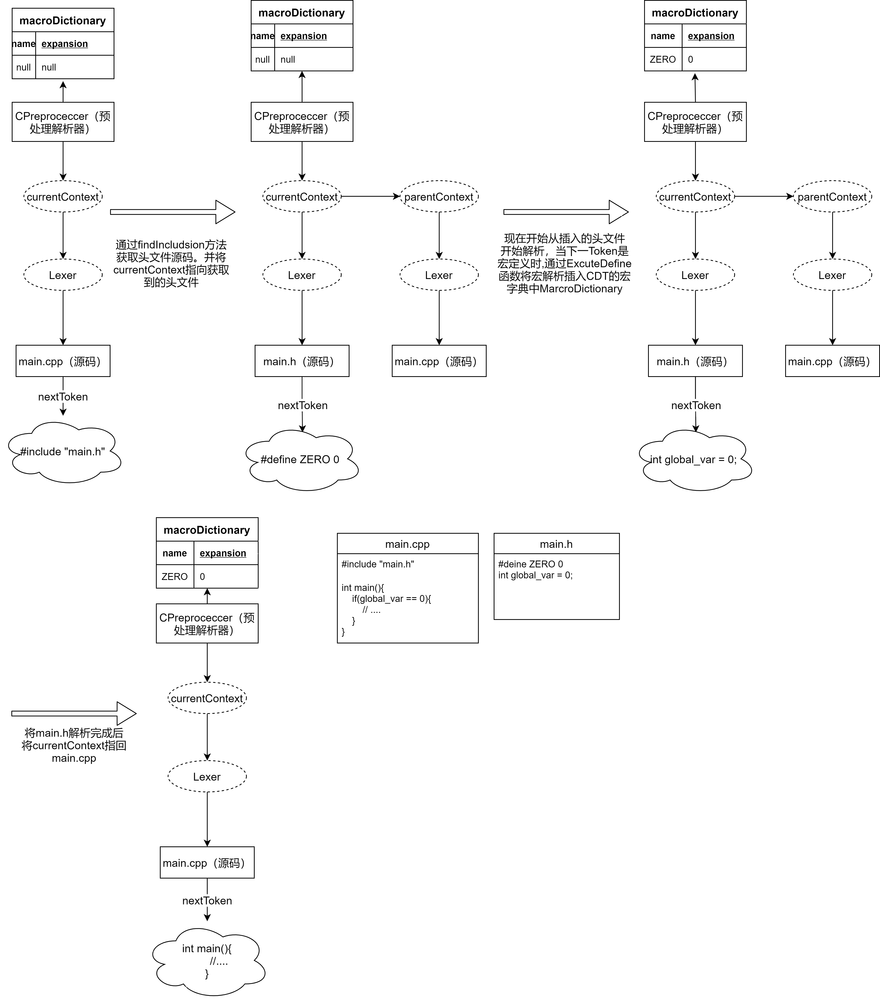

# *CDT解析*
</br>

## *主要类与接口介绍*
<br>


### 1.  **org.eclipse.cdt.core.model.ILanguage**  接口

<br>

- *ILanguage接口是语言模型接口，主要负责解析生成语法树*

<br>

| 常量 | 值 | 作用 |
| --- | ---|---|
|OPTION_SKIP_FUNCTION_BODIES|0x01|控制构建语法树时跳过函数体，不构建函数体|
|OPTION_ADD_COMMENTS|0x02|弃用|
|OPTION_NO_IMAGE_LOCATIONS|0x04|控制语法树构建，IASTName.getImageLoacation() == null|
|OPTION_SKIP_TRIVIAL_EXPRESSIONS_IN_AGGREGATE_INITIALIZERS|0x10|控制语法树构建时，没有名称的初始化不生成结构|
|OPTION_PARSE_INACTIVE_CODE|0x20|控制语法树对非活动语句的构建|

<br>

| 关注方法      | 作用 |
| ----------- | ----------- |
| getASTTranslationUnit    | 语法树构建函数 支持从Index构建或直接构建 | 
| getCompletionNode  | 根据传入的位置，对文件中对应位置的代码构建语法树节点 |

<br>

- 实现类：**AbstractCLikeLanguage** 类实现了构造语法树的方法 **getASTTranslationUnit**:

<div id = "getASTTranslationUnit"></div>

```java

	/**
	 * 构造语法树函数
	 * @param reader FileContent实现类 提供构造的源文件源码
	 * @param scanInfo IScanner实现类 提供构造所需相关配置和信息 包括include的路径和配置的宏
	 * @param fileCreator 提供文件内容
	 * @param index 索引
	 * @param options 构造参数 ILanguage常量
	 * @param log 日志
	 */
	@Override
	public IASTTranslationUnit getASTTranslationUnit(FileContent reader, IScannerInfo scanInfo,
			IncludeFileContentProvider fileCreator, IIndex index, int options, IParserLogService log)
			throws CoreException
	{   
        // 加载配置 scannerinfo 将一些预置的宏、关键字和include路径加入到scanner中去
		// 构建预处理器scanner
		final IScanner scanner = createScanner(reader, scanInfo, fileCreator, log);
		scanner.setComputeImageLocations((options & OPTION_NO_IMAGE_LOCATIONS) == 0);
		scanner.setProcessInactiveCode((options & OPTION_PARSE_INACTIVE_CODE) != 0);

		IParserSettings parserSettings = null;
		if (scanInfo instanceof ExtendedScannerInfo)
		{
			ExtendedScannerInfo extendedScannerInfo = (ExtendedScannerInfo) scanInfo;
			parserSettings = extendedScannerInfo.getParserSettings();
		}

        // 构建语法解析parser
		final ISourceCodeParser parser = createParser(scanner, log, index, false, options, parserSettings);

		// Make it possible to cancel parser by reconciler -
		// http://bugs.eclipse.org/226682
		ICanceler canceler = null;
		if (log instanceof ICanceler)
		{
			canceler = (ICanceler) log;
			canceler.setCancelable(new ICancelable()
				{
					@Override
					public void cancel()
					{
						scanner.cancel();
						parser.cancel();
					}
				});
		}

		try
		{
			// Parse  开始解析语法树
			return parser.parse();
		}
		catch (ParseError e)
		{
			// Only the TOO_MANY_TOKENS error can be handled here.
			if (e.getErrorKind() != ParseErrorKind.TOO_MANY_TOKENS) throw e;

			// Otherwise generate a log because parsing was stopped because of a user
			// preference.
			if (log != null)
			{
				String tuName = null;
				if (scanner.getLocationResolver() != null)
					tuName = scanner.getLocationResolver().getTranslationUnitPath();

				log.traceLog(e.getMessage() + (tuName == null ? "" : (" while parsing " + tuName))); //$NON-NLS-1$ //$NON-NLS-2$
			}
			return null;
		}
		finally
		{
			if (canceler != null)
			{
				canceler.setCancelable(null);
			}
		}
	}
```
目前GJB引擎构建语法树也是从这个入口。


-------------------------------
<br>

### 2. **org.eclipse.cdt.core.parser.IScannerInfo**  接口
<br>

- *IScannerInfo*  接口主要是为了为CDT的预处理提供配置和信息。

<br>

| 关注方法      | 作用 |
| ----------- | ----------- |
| getDefinedSymbols | 返回预置的一些宏 | 
| getIncludePaths  | 返回预制的include搜索路径 |

- 目前GJB引擎是自己实现了该接口 自定义导入一些预制宏。
- ```java
    /**
     * Private class that tells the Eclipse CDT scanner that no macros and
     * include paths have been defined externally.
     */
    protected static class StubScannerInfo implements IScannerInfo {

        private static final ImmutableMap<String, String> MACROS;

        @Override
        public Map<String, String> getDefinedSymbols() {
            // the externally defined pre-processor macros
            return MACROS;
        }

        @Override
        public String[] getIncludePaths() {
            return new String[0];
        }
    }
--------------------------
<br>


<div id = "CPreproceccer_class"></div>

### 3. **org.eclipse.cdt.internal.core.parser.scanner.CPreprocesser**  类 （解析的主要信息类）
- 继承 *IScanner* 接口，CPreprocessor类负责提供解析所需要的 *Token* 流和将 *IScannerInfo* 所提供的信息及相关 **解析配置** 存储供后续词法和语法分析使用。
- 主要属性：

|类型|name|作用|
|---|---|---|
|AbstractParserLogService |fLog|日志|
|LexerOptions | fLexOptions |词法解析参数,根据解析时传入的info设置|
|MacroExpander |fMacroExpander|当前语法树的所有宏扩展存储类|
|CharArrayIntMap |fKeywords/fPPKeywords|关键字存储数据结构|
|IncludeSearchPath |fIncludeSearchPath|设置外部配置include的路径|
|String[][] |fPreIncludedFiles|暂时不确定|
|CharArrayMap&lt;PreprocessorMacro> |fMacroDictionary| 当前宏的存储结构(属于fMacroExpander的一部分) |
|LocationMap |fLocationMap| 存储语法树相关信息包含宏、注释、problem等信息，也提供计算上下问的offset的功能|
|ScannerContext| fRootContext | 语法树根状态记录 |
|ScannerContext |fCurrentContext|当前解析语法树的状态记录|
|InternalFileContent|fRootContent|根语法树的文件源码字符存储类|
|ExpressionEvaluator|fExpressionEvaluator|表达式计算器|
|MacroDefinitionParser|fMacroDefinitionParser||

- 主要方法：

|name|作用|
|---|---|
|nextToken()|获取下一个Token 实现自 *IScanner*|
|fetchToken()|从Lexer抓取下一个Token |
|executeDirective()|当Token是 *#* 时,进入该方法处理预处理指令  [点此查看函数](#executeDirective)|
|executeInclude()|当预处理指令是include类型引入头文件时，进入该方法处理  [点此查看函数](#executeInclude)|
|findInclusion()|搜索头文件函数 找到则将源码取出  [点此查看函数](#findInclusion)|
---------------------------------------
<br>

### 4. **org.eclipse.cdt.core.dom.parser.ISourceCodeParser** 接口
- 源码解析接口
- 主要方法：

|name|作用|
|---|---|
|parse()|解析启动|
------------------------------
<br>

### 5. **org.eclipse.cdt.internal.core.dom.parser.AbstractGNUSourceCodeParser**  抽象类 继承自 *ISourceCodeParser*
- 语法解析模块基类,提供C++/C公共的语法解析
- 主要方法(根据实际解析顺序)：

|name|作用|
|---|---|
|translationUnit()|解析启动函数|
|parseTranslationUnit()|开始解析|
|declarationList()|为ast根节点生成declaration子节点|
|acceptInactiveCodeBoundary()|检查下一个Token是不是活跃代码|
|nextToken()|获取下一个Token(已经经过宏替换/预处理后的)|
|fetchToken()|抓取下一个Token|
---------------------------
<br>


### 6. **org.eclipse.cdt.internal.core.parser.scanner.ScannerContext** 类
- 负责存储语法树解析的状态
- 主要属性：
- ```java
	private CodeState fInactiveState = CodeState.eSkipInactive;
	private final int fDepth; // 语法树嵌套深度
	private final ILocationCtx fLocationCtx; 
	private final ScannerContext fParent; // 引用该文件的context
	private final Lexer fLexer; // 词法解析器
	private Token fTokens;// 当前Token
	private ArrayList<Conditional> fConditionals;
	private CodeState fCurrentState = CodeState.eActive;
	private IncludeSearchPathElement fFoundOnPath; // 该引用文件的路径
	private String fFoundViaDirective;
	private CharArraySet fInternalModifications;
	private CharArrayObjectMap<char[]> fSignificantMacros;
	private boolean fPragmaOnce;
	private int fLoadedVersionCount;
- 主要方法：

|name|作用|
|---|---|
|nextPPToken()|从 Lexer 获取下一个Token|
-----------------------------

<br>

### 7. **org.eclipse.cdt.internal.core.parser.scanner.Lexer**  类
- 词法解析类 负责词法解析
- 主要属性
```java
	// configuration
	private final LexerOptions fOptions;
	private boolean fSupportContentAssist = false;
	private final Object fSource; // 源码

	// the input to the lexer
	private final AbstractCharArray fInput;
	private final int fStart;
	private int fLimit;

	// after phase 3 (newline, trigraph, line-splice)
	private int fOffset;
	private int fEndOffset;
	private int fCharPhase3;

	private Token fToken;
	private Token fLastToken;
```
- 主要方法：

|name|作用|
|---|---|
|nextToken()|获取下一个Token|
|currentToken()|获取当前进行到的Token|
|saveState()|记录并保存当前状态|

--------------------
<br>


### 8. **org.eclipse.cdt.internal.core.parser.scanner.Token** 类
- 存储一个个单词
- 关键属性 Type 决定该单词的类型 
-------------
<br>

## **解析过程**：以CPP为例
- 下面是解析流程



- 从上图看我认为CDT现在的解析大致可以分成四个模块 分别是 **初始化模块、语法解析模块、预处理模块和词法解析模块**。

<br>

### **第一部分 初始化配置信息**
- 入口函数 [getASTTranslationUnit()](#getASTTranslationUnit) 初始化信息，构建出预处理器CPreproceccer(内置词法解析器Lexer)、语法解析器GNUCPPSourceParser。
- 主要方法预处理器 [Cpreprececcer构造函数](#CPreproceccer) 和 [GNUCPPSourceParser](#GNUCPPSourceParser) 构造函数

<br>

### **第二部分 语法解析**
- 语法解析部分暂未分析

<br>

### **第三部分 预处理**
- 预处理主要功能在 **[CPreproceccer](#CPreproceccer_class)** 类、**[MacroDefinitionParser](#MacroDefinitionParser_class)** 和 **[ExpressionEvaluator](#MacroDefinitionParser_class)** 类中
- 预处理解析流程图如下所示：



- 其中头文件解析流程图如下所示：



<br>

### **第四部分 词法解析**

- 词法解析暂未分析

<div id = "CPreproceccer">CPreproceccer构造函数</div>

```java
	public CPreprocessor(FileContent fileContent, IScannerInfo info, ParserLanguage language, IParserLogService log,
			IScannerExtensionConfiguration configuration, IncludeFileContentProvider readerFactory)
	{
		fLog = AbstractParserLogService.convert(log);
		fAdditionalNumericLiteralSuffixes = nonNull(configuration.supportAdditionalNumericLiteralSuffixes());
		fLexOptions.fSupportDollarInIdentifiers = configuration.support$InIdentifiers();
		fLexOptions.fSupportAtSignInIdentifiers = configuration.supportAtSignInIdentifiers();
		fLexOptions.fSupportMinAndMax = configuration.supportMinAndMaxOperators();
		fLexOptions.fSupportSlashPercentComments = configuration.supportSlashPercentComments();
		fLexOptions.fSupportUTFLiterals = configuration.supportUTFLiterals();
		fLexOptions.fSupportRawStringLiterals = configuration.supportRawStringLiterals();
		fLexOptions.fSupportUserDefinedLiterals = configuration.supportUserDefinedLiterals();
		fLexOptions.fSupportDigitSeparators = configuration.supportDigitSeparators();
		if (info instanceof ExtendedScannerInfo)
			fLexOptions.fIncludeExportPatterns = ((ExtendedScannerInfo) info).getIncludeExportPatterns();
		fLocationMap = new LocationMap(fLexOptions);
		fKeywords = new CharArrayIntMap(40, -1);
		fPPKeywords = new CharArrayIntMap(40, -1);
		configureKeywords(language, configuration);// 导入关键字
		// 构造表达式计算器、宏定义解析器
		fExpressionEvaluator = new ExpressionEvaluator(this);
		fMacroDefinitionParser = new MacroDefinitionParser();
		fMacroExpander = new MacroExpander(this, fMacroDictionary, fLocationMap, fLexOptions);
		fIncludeFileResolutionHeuristics = fFileContentProvider.getIncludeHeuristics();

		String contextPath = fFileContentProvider.getContextPath();
		if (contextPath == null)
		{
			contextPath = fRootContent.getFileLocation();
		}
		// 将info自己配置的头文件路径导入 预处理类中
		fIncludeSearchPath = configureIncludeSearchPath(new File(contextPath).getParentFile(), info);
		setupMacroDictionary(configuration, info, language);

		ILocationCtx ctx = fLocationMap.pushTranslationUnit(fRootContent.getFileLocation(), fRootContent.getSource());
		Lexer lexer = new Lexer(fRootContent.getSource(), fLexOptions, this, this); // 构造词法解析器
		fRootContext = fCurrentContext = new ScannerContext(ctx, null, lexer);
		if (info instanceof IExtendedScannerInfo)
		{
			final IExtendedScannerInfo einfo = (IExtendedScannerInfo) info;
			fPreIncludedFiles = new String[][] { einfo.getMacroFiles(), einfo.getIncludeFiles() };
		}
		fFileContentProvider.resetForTranslationUnit();
	}
```
<div id="executeDirective">executeDirective函数</div>

```java
	/**
	 * Assumes that the pound token has not yet been consumed
	 * 处理预处理指令的方法  遇到#符号且其他情况排除后进入该方法判断预处理的类型
	 * @since 5.0
	 */
	private void executeDirective(final Lexer lexer, final int startOffset, boolean withinExpansion)
			throws OffsetLimitReachedException
	{
		final Token ident = lexer.nextToken();
		switch (ident.getType())
		{
			case IToken.tCOMPLETION:
				lexer.nextToken();
				Token completionToken = new TokenWithImage(ident.getType(), null, startOffset, ident.getEndOffset(),
						("#" + ident.getImage()).toCharArray()); //$NON-NLS-1$
				throw new OffsetLimitReachedException(ORIGIN_PREPROCESSOR_DIRECTIVE, completionToken);

			case Lexer.tNEWLINE:
				return;

			case IToken.tEND_OF_INPUT:
			case IToken.tINTEGER:
				lexer.consumeLine(ORIGIN_PREPROCESSOR_DIRECTIVE);
				return;

			case IToken.tIDENTIFIER:
				break;

			default:
				int endOffset = lexer.consumeLine(ORIGIN_PREPROCESSOR_DIRECTIVE);
				handleProblem(IProblem.PREPROCESSOR_INVALID_DIRECTIVE, ident.getCharImage(), startOffset, endOffset);
				return;
		}

		// we have an identifier 这里确认是预处理指令 开始判断其指令类型
		final char[] name = ident.getCharImage();
		final int type = fPPKeywords.get(name);
		int condEndOffset;
		switch (type)
		{
			case IPreprocessorDirective.ppImport:
			case IPreprocessorDirective.ppInclude:
			case IPreprocessorDirective.ppInclude_next:// 当是include类型指令时，进入executeInclude方法
				executeInclude(lexer, startOffset, type, fCurrentContext.getCodeState() == CodeState.eActive,
						withinExpansion);
				break;

			case IPreprocessorDirective.ppDefine:
				CodeState state = fCurrentContext.getCodeState();
				if (state == CodeState.eSkipInactive)
				{
					lexer.consumeLine(ORIGIN_PREPROCESSOR_DIRECTIVE);
				}
				else
				{
					executeDefine(lexer, startOffset, state == CodeState.eActive);
				}
				break;

			case IPreprocessorDirective.ppUndef:
				state = fCurrentContext.getCodeState();
				if (state == CodeState.eSkipInactive)
				{
					lexer.consumeLine(ORIGIN_PREPROCESSOR_DIRECTIVE);
				}
				else
				{
					executeUndefine(lexer, startOffset, fCurrentContext.getCodeState() == CodeState.eActive);
				}
				break;

			case IPreprocessorDirective.ppIfdef:
				if (executeIfdef(lexer, startOffset, false, withinExpansion) == CodeState.eSkipInactive)
					skipOverConditionalCode(lexer, withinExpansion);
				break;

			case IPreprocessorDirective.ppIfndef:
				if (executeIfdef(lexer, startOffset, true, withinExpansion) == CodeState.eSkipInactive)
					skipOverConditionalCode(lexer, withinExpansion);
				break;

			case IPreprocessorDirective.ppIf:
				if (executeIf(lexer, startOffset, false, withinExpansion) == CodeState.eSkipInactive)
					skipOverConditionalCode(lexer, withinExpansion);
				break;

			case IPreprocessorDirective.ppElif:
				if (executeIf(lexer, startOffset, true, withinExpansion) == CodeState.eSkipInactive)
				{
					skipOverConditionalCode(lexer, withinExpansion);
				}
				break;

			case IPreprocessorDirective.ppElse:
				if (executeElse(lexer, startOffset, withinExpansion) == CodeState.eSkipInactive)
				{
					skipOverConditionalCode(lexer, withinExpansion);
				}
				break;

			case IPreprocessorDirective.ppEndif:
				executeEndif(lexer, startOffset, withinExpansion);
				break;

			case IPreprocessorDirective.ppWarning:
			case IPreprocessorDirective.ppError:
				int condOffset = lexer.nextToken().getOffset();
				condEndOffset = lexer.consumeLine(ORIGIN_PREPROCESSOR_DIRECTIVE);
				// Missing argument
				if (condEndOffset < condOffset)
				{
					condOffset = condEndOffset;
				}
				if (fCurrentContext.getCodeState() == CodeState.eActive)
				{
					int endOffset = lexer.currentToken().getEndOffset();
					final char[] warning = lexer.getInputChars(condOffset, condEndOffset);
					final int id = type == IPreprocessorDirective.ppError ? IProblem.PREPROCESSOR_POUND_ERROR
							: IProblem.PREPROCESSOR_POUND_WARNING;
					handleProblem(id, warning, condOffset, condEndOffset);
					fLocationMap.encounterPoundError(startOffset, condOffset, condEndOffset, endOffset);
				}
				break;

			case IPreprocessorDirective.ppPragma:
				Token pragmaToken = lexer.nextToken();
				condOffset = pragmaToken.getOffset();
				condEndOffset = lexer.consumeLine(ORIGIN_PREPROCESSOR_DIRECTIVE);
				// Missing argument
				if (condEndOffset < condOffset)
				{
					condOffset = condEndOffset;
				}
				if (fCurrentContext.getCodeState() == CodeState.eActive)
				{
					int endOffset = lexer.currentToken().getEndOffset();
					fLocationMap.encounterPoundPragma(startOffset, condOffset, condEndOffset, endOffset);
					if (CharArrayUtils.equals(ONCE, pragmaToken.getCharImage()))
					{
						IFileNomination nom = fLocationMap.reportPragmaOnceSemantics(fCurrentContext.getLocationCtx());
						fFileContentProvider.reportPragmaOnceSemantics(getCurrentFilename(), nom);
					}
				}
				break;

			case IPreprocessorDirective.ppIgnore:
				lexer.consumeLine(ORIGIN_PREPROCESSOR_DIRECTIVE);
				break;

			default:
				int endOffset = lexer.consumeLine(ORIGIN_PREPROCESSOR_DIRECTIVE);
				if (fCurrentContext.getCodeState() == CodeState.eActive)
				{
					handleProblem(IProblem.PREPROCESSOR_INVALID_DIRECTIVE, ident.getCharImage(), startOffset,
							endOffset);
				}
				break;
		}
	}
```

<div id = "executeInclude">executeInclude函数</div>

```java
	private void executeInclude(final Lexer lexer, int poundOffset, int includeType, boolean active,
			boolean withinExpansion) throws OffsetLimitReachedException
	{
		// Make sure to clear the extern include guard.
		final char[] externGuard = fExternIncludeGuard;
		fExternIncludeGuard = null;

		if (withinExpansion)
		{
			final char[] name = lexer.currentToken().getCharImage();
			final int endOffset = lexer.consumeLine(ORIGIN_PREPROCESSOR_DIRECTIVE);
			handleProblem(IProblem.PREPROCESSOR_INVALID_DIRECTIVE, name, poundOffset, endOffset);
			return;
		}

		lexer.setInsideIncludeDirective(true);
		final Token header = lexer.nextToken(); // 获取#include后一个Token 也即头文件 
		lexer.setInsideIncludeDirective(false);

		int condEndOffset = header.getEndOffset();
		final int[] nameOffsets = new int[] { header.getOffset(), condEndOffset };
		char[] headerName = null;
		boolean userInclude = true;

		switch (header.getType())
		{
			case Lexer.tSYSTEM_HEADER_NAME: // 系统头文件格式
				userInclude = false;
				headerName = extractHeaderName(header.getCharImage(), '<', '>', nameOffsets);
				condEndOffset = lexer.consumeLine(ORIGIN_PREPROCESSOR_DIRECTIVE);
				break;

			case Lexer.tQUOTE_HEADER_NAME: // “” 格式头文件
				headerName = extractHeaderName(header.getCharImage(), '"', '"', nameOffsets);
				condEndOffset = lexer.consumeLine(ORIGIN_PREPROCESSOR_DIRECTIVE);
				break;

			case IToken.tCOMPLETION:
				throw new OffsetLimitReachedException(ORIGIN_PREPROCESSOR_DIRECTIVE, header);

			case IToken.tIDENTIFIER:
				TokenList tl = new TokenList();
				condEndOffset = nameOffsets[1] = getTokensWithinPPDirective(false, tl, false);
				Token t = tl.first();
				if (t != null)
				{
					switch (t.getType())
					{
						case IToken.tSTRING:
							headerName = extractHeaderName(t.getCharImage(), '"', '"', new int[] { 0, 0 });
							break;

						case IToken.tLT:
							userInclude = false;
							boolean complete = false;
							StringBuilder buf = new StringBuilder();
							t = (Token) t.getNext();
							while (t != null)
							{
								if (t.getType() == IToken.tGT)
								{
									complete = true;
									break;
								}
								buf.append(t.getImage());
								t = (Token) t.getNext();
							}
							if (complete)
							{
								headerName = new char[buf.length()];
								buf.getChars(0, buf.length(), headerName, 0);
							}
					}
				}
				break;

			default:
				condEndOffset = lexer.consumeLine(ORIGIN_PREPROCESSOR_DIRECTIVE);
				break;
		}

		if (headerName == null || headerName.length == 0)
		{
			if (active)
			{
				handleProblem(IProblem.PREPROCESSOR_INVALID_DIRECTIVE, lexer.getInputChars(poundOffset, condEndOffset),
						poundOffset, condEndOffset);
			}
			return;
		}

		if (includeType == IPreprocessorDirective.ppImport)
		{
			// Imports are executed only once.
			// See
			// http://gcc.gnu.org/onlinedocs/gcc-3.2/cpp/Obsolete-once-only-headers.html.
			if (fImports != null && fImports.containsKey(headerName)) return;
			if (active)
			{
				if (fImports == null) fImports = new CharArraySet(0);
				fImports.put(headerName);
			}
		}

		if ((active && fCurrentContext.getDepth() == MAX_INCLUSION_DEPTH)
				|| (fPreventInclusion != null && fPreventInclusion.containsKey(headerName)))
		{
			handleProblem(IProblem.PREPROCESSOR_EXCEEDS_MAXIMUM_INCLUSION_DEPTH,
					lexer.getInputChars(poundOffset, condEndOffset), poundOffset, condEndOffset);
			if (fPreventInclusion == null) fPreventInclusion = new CharArraySet(0);
			fPreventInclusion.put(headerName);
			return;
		}

		boolean includeNext = includeType == IPreprocessorDirective.ppInclude_next;
		final String includeDirective = new String(headerName);
		if (!active)
		{
			// Inactive include
			String path = null;
			boolean isHeuristic = false;
			IFileNomination nominationDelegate = null;

			if (externGuard != null)
			{
				// #ifndef GUARD
				// #include "file.h"
				// #endif
				// When the extern guard matches we need to resolve the inclusion. We don't
				// actually
				// check whether the guard matches.
				final IncludeResolution resolved = findInclusion(includeDirective, userInclude, includeNext,
						getCurrentFilename(), createPathTester);
				if (resolved != null)
				{
					nominationDelegate = fFileContentProvider.isIncludedWithPragmaOnceSemantics(resolved.fLocation);
					if (nominationDelegate != null)
					{
						path = resolved.fLocation;
						isHeuristic = resolved.fHeuristic;
					}
				}
			}
			fLocationMap.encounterPoundInclude(poundOffset, nameOffsets[0], nameOffsets[1], condEndOffset, headerName,
					path, userInclude, active, isHeuristic, nominationDelegate);
			return;
		}

		// Active include
		// 这一步将头文件源码取出  后面将进行内联操作 将头文件源码与源文件源码合并在一起
		final InternalFileContent fi = findInclusion(includeDirective, userInclude, includeNext, getCurrentFilename(),
				createCodeReaderTester);
		String absoluteInclusionPath = "D:\\CDT\\data\\QT\\QT_house\\QT_testcase\\test\\1.h";
		final boolean foundHeader = CDTTest.addDeclarationToUnit(absoluteInclusionPath,CDTTest.root);
		if (fi == null)
		{
			// Unresolved active include
			final int len = headerName.length + 2;
			StringBuilder name = new StringBuilder(len);
			name.append(userInclude ? '"' : '<');
			name.append(headerName);
			name.append(userInclude ? '"' : '>');

			final char[] nameChars = new char[len];
			name.getChars(0, len, nameChars, 0);
			handleProblem(IProblem.PREPROCESSOR_INCLUSION_NOT_FOUND, nameChars, poundOffset, condEndOffset);
			fLocationMap.encounterPoundInclude(poundOffset, nameOffsets[0], nameOffsets[1], condEndOffset, headerName,
					null, userInclude, active, false, null);
			return;
		}

		// Resolved active include
		final String path = fi.getFileLocation();
		final boolean isHeuristic = false;
		final boolean pragmaOnceContext = fCurrentContext.isPragmaOnce();

		IFileNomination nominationDelegate = null;
		ASTInclusionStatement stmt = null;
		List<ISignificantMacros> loadedVerisons = null;

		// 2023.1.17 wsf  
		// Will be parsed 将代码内联进源码后 修改相关信息
		AbstractCharArray source = fi.getSource();
		if (source != null)
		{
			ILocationCtx ctx = fLocationMap.pushInclusion(poundOffset, nameOffsets[0], nameOffsets[1],
					condEndOffset, source, path, headerName, userInclude, isHeuristic, fi.isSource());
			ScannerContext fctx = new ScannerContext(ctx, fCurrentContext,
					new Lexer(source, fLexOptions, this, this));
			fctx.setFoundOnPath(null, includeDirective);
			detectIncludeGuard(path, source, fctx);
			fCurrentContext = fctx;
			stmt = ctx.getInclusionStatement();
			stmt.setIncludedFileTimestamp(fi.getTimestamp());
			stmt.setIncludedFileSize(fi.getFileSize());
			stmt.setIncludedFileContentsHash(source.getContentsHash());
			stmt.setIncludedFileReadTime(fi.getReadTime());
			stmt.setErrorInIncludedFile(source.hasError());
			if (!fCurrentContext.isPragmaOnce())
			{
				// Track the loaded version count, even in a non-pragma-once context.
				loadedVerisons = fFileContentProvider.getLoadedVersions(path);
				fctx.setLoadedVersionCount(loadedVerisons.size());
			}
		}
		fLocationMap.parsingFile(fFileContentProvider, fi);
		// wsf

		if (stmt == null)
		{
			// Found in index or skipped.
			stmt = fLocationMap.encounterPoundInclude(poundOffset, nameOffsets[0], nameOffsets[1], condEndOffset,
					headerName, path, userInclude, active, isHeuristic, nominationDelegate);
			if (fi.getKind() == InclusionKind.SKIP_PRAGMA_ONCE_FILE)
			{
				stmt.setSignificantMacros(fi.getSignificantMacros());
				stmt.setPragamOnceSemantics(true);
			}
		}
//		 In a pragma once context store loaded versions of this non-pragma-once
//		 include
		if (pragmaOnceContext && loadedVerisons != null && !loadedVerisons.isEmpty())
		{
			stmt.setLoadedVersions(loadedVerisons.toArray(new ISignificantMacros[loadedVerisons.size()]));
		}
	}
```
<div id = "findInclusion">findInclusion函数</div>

```java
	private <T> T findInclusion(final String includeDirective, final boolean quoteInclude, final boolean includeNext,
			final String currentFile, final IIncludeFileTester<T> tester)
	{
		T reader = null;
		String absoluteInclusionPath = getAbsoluteInclusionPath(includeDirective, currentFile);
		if (absoluteInclusionPath != null)
		{
			return tester.checkFile(absoluteInclusionPath, false, null);
		}

		if (currentFile != null && quoteInclude && !includeNext
				&& !fIncludeSearchPath.isInhibitUseOfCurrentFileDirectory())
		{
			// Check to see if we find a match in the directory of the current file 检查是否在当前目录
			final File currentDir = new File(currentFile).getParentFile();
			if (currentDir != null)
			{
				final String fileLocation = ScannerUtility.createReconciledPath(currentDir.getAbsolutePath(),
						includeDirective);
				reader = tester.checkFile(fileLocation, false, null);
				if (reader != null)
				{
					return reader;
				}
			}
		}

		// Now we need to search for the file on the include search path.
		// If this is a include_next directive then the search starts with the directory
		// in the search path after the one where the current file was found.
		// 这里就去我们传入的目录进行匹配
		IncludeSearchPathElement searchAfter = null;
		if (includeNext && currentFile != null)
		{
			searchAfter = fCurrentContext.getFoundOnPath();
			if (searchAfter == null)
			{
				// the current file was found without search path
				String directive = fCurrentContext.getFoundViaDirective();
				if (directive == null)
				{
					directive = new File(currentFile).getName();
				}
				searchAfter = findFileInIncludePath(currentFile, directive);
			}
		}

		for (IncludeSearchPathElement path : fIncludeSearchPath.getElements())
		{
			if (searchAfter != null)
			{
				if (searchAfter.equals(path))
				{
					searchAfter = null;
				}
			}
			else
				if (quoteInclude || !path.isForQuoteIncludesOnly())
				{
					String fileLocation = path.getLocation(includeDirective);
					if (fileLocation != null)
					{
						reader = tester.checkFile(fileLocation, false, path);
						if (reader != null)
						{
							return reader;
						}
					}
				}
		}
		if (fIncludeFileResolutionHeuristics != null)
		{
			String location = fIncludeFileResolutionHeuristics.findInclusion(includeDirective, currentFile);
			if (location != null)
			{
				return tester.checkFile(location, true, null);
			}
		}
		return null;
	}
```


